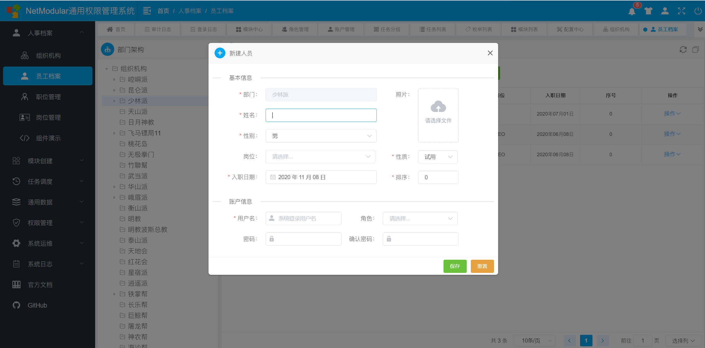
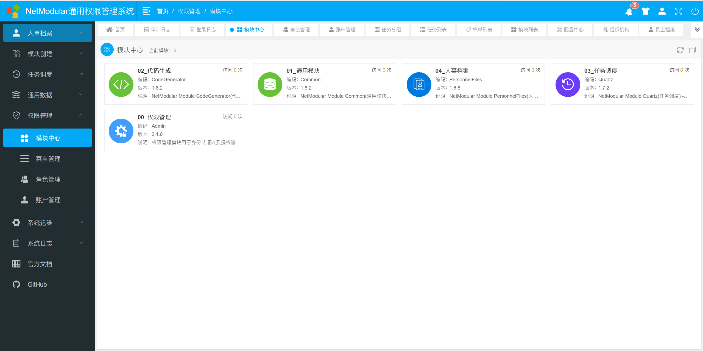
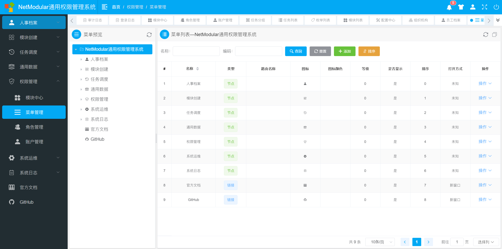

<h1 align="center">
  
 
NetModular
</h1>

  

## NetModular 是什么

NetModular 是一款为中小型企业而生的基于.Net Core 平台的业务模块化快速开发解决方案，最终目的是能够让中小团队快速搭建公司内部开发平台。

## 演示地址

本仓库只包含后端框架代码，为了方便大家调试运行，同时包含了权限管理模块的代码，但是演示地址是把现有的几个模块整合后发布的，所以当你运行本仓库发现与线上不一样的时候，请下载演示源码，并且需要自己配置菜单~

演示地址：[https://demo.17mkh.com/](https://demo.17mkh.com/)  
账 户：admin  
密 码: admin

演示源码：[https://github.com/iamoldli/NetModular.Demo](https://github.com/iamoldli/NetModular.Demo)

## 演示截图

<h1 align="center">
  
  
  
  
 

## 后端框架结构说明

| 框架模块      | 说明                                                                                                      | 版本                                                                                                                                                                                                                                                       |
| ------------- | --------------------------------------------------------------------------------------------------------- | ---------------------------------------------------------------------------------------------------------------------------------------------------------------------------------------------------------------------------------------------------------- |
| 00_Host       | 主机库                                                                                                    |                                               |
| 01_Utils      | 通用基础库                                                                                                |                                          |
| 02_Data       | 轻量级 ORM 库(基于 <a href="https://github.com/StackExchange/Dapper">Dapper</a> 扩展)                     |                     |
| 03_Logging    | 日志库(基于 <a href="https://github.com/serilog/serilog">Serilog</a> 扩展)                                |                           |
| 04_Mapper     | 对象映射库(基于 <a href="https://github.com/AutoMapper/AutoMapper">AutoMapper</a> 扩展)                   |                     |
| 05_Swagger    | 接口文档库(基于 <a href="https://github.com/domaindrivendev/Swashbuckle.AspNetCore">Swashbuckle</a> 扩展) |                                     |
| 06_Cache      | 缓存库，支持内存缓存和 Redis                                                                              |                  |
| 07_Validation | 模型验证库(基于 <a href="https://github.com/FluentValidation/FluentValidation">FluentValidation</a> 扩展) |   |
| 08_Auth       | 身份认证库，已实现 JWT 认证方式                                                                           |                     |
| 09_Module     | 业务模块化核心库                                                                                          |               |
| 10_MQ         | 消息通讯库，实现对 RabbitMQ 的封装                                                                        |                                       |
| 11_Quartz     | 基于 <a href="https://github.com/quartznet/quartznet">Quartz.Net</a> 封装的任务调度库                     |               |
| 12_Excel      | Excel 扩展库                                                                                              |                  |
| 13_Config     | 通用配置库                                                                                                |               |
| 14_Pdf        | PDF 扩展库                                                                                                |                        |
| 15_MQTT       | MQTT 扩展库(未实现)                                                                                       |                                                                                                                                                                                                                                                            |
| 16_OSS        | 对象存储库，内含七牛云 SDK 的 Core 版本                                                                   |                        |

## 开发环境

> 开发工具
>
> > [Visual Studio 2019+](https://visualstudio.microsoft.com/zh-hans/downloads/)、[Visual Studio Code](https://code.visualstudio.com/)

> 后端
>
> > [.Net Core 3.1](https://dotnet.microsoft.com/download)、[Dapper](https://github.com/StackExchange/Dapper)、[Serilog](https://serilog.net/)、[AutoMapper](https://automapper.org/)、[FluentValidation](https://fluentvalidation.net)、[Swagger](https://github.com/domaindrivendev/Swashbuckle.AspNetCore)、RabbitMQ、Redis、EPPlus

> 前端
>
> > [Node.js 10+](https://nodejs.org/en/)、[Vue.js 2.6+](https://cn.vuejs.org/)、[Vue CLI](https://cli.vuejs.org/zh/guide/)、[Vuex](https://vuex.vuejs.org/zh/)、[VueRouter](https://router.vuejs.org/zh/)、[Element-UI](https://element.eleme.cn/#/zh-CN/component/installation)

## 前端框架 NetModular.UI

 

前端采用 Vue.js 全家桶+Element UI 开发，也是基于模块化思想设计，源码不在本仓库，请移步 [NetModular.UI](https://github.com/iamoldli/NetModular.UI)

## 前端皮肤

前端支持自定义皮肤功能，框架本身提供了两套皮肤，其中一套已经内置作为默认皮肤，另外一套需要单独安装，源码如下：

| 编码     | 版本                                                                                                                                     | 仓库地址                                                                           |
| -------- | ---------------------------------------------------------------------------------------------------------------------------------------- | ---------------------------------------------------------------------------------- |
| Classics |   | [NetModular.Skins.Classics](https://github.com/iamoldli/NetModular.Skins.Classics) |

## 官方文档

文档地址： [https://docs.17mkh.com](https://docs.17mkh.com)

文档项目的源码请移步： [https://github.com/iamoldli/NetModular.Docs](https://github.com/iamoldli/NetModular.Docs)

## 视频教程

[NetModular 的正确打开方式~](https://www.bilibili.com/video/BV14v41147TT/)

## 模块列表

本仓库只包含基础框架以及权限管理(Admin)模块代码，其它模块请点击以下链接查看~

| 编号 | 编码           | 说明                     | 版本                                                                                                                                                                                                                                                 | 仓库地址                                                                                         |
| ---- | -------------- | ------------------------ | ---------------------------------------------------------------------------------------------------------------------------------------------------------------------------------------------------------------------------------------------------- | ------------------------------------------------------------------------------------------------ |
| 00   | Admin          | 权限管理                 |                              | 本仓库                                                                                           |
| 01   | Common         | 通用模块                 |                           | [NetModular.Module.Common](https://github.com/iamoldli/NetModular.Module.Common)                 |
| 02   | CodeGenerator  | 模块创建(又名代码生成器) |      | [NetModular.Module.CodeGenerator](https://github.com/iamoldli/NetModular.Module.CodeGenerator)   |
| 03   | Quartz         | 任务调度                 |                           | [NetModular.Module.Quartz](https://github.com/iamoldli/NetModular.Module.Quartz)                 |
| 04   | PersonnelFiles | 人事档案                 |   | [NetModular.Module.PersonnelFiles](https://github.com/iamoldli/NetModular.Module.PersonnelFiles) |

## 技术交流

QQ 群：点击加群 [903210423](http://shang.qq.com/wpa/qunwpa?idkey=cfc871fccc7173f17ac2c9d12c8a31a7549c260e6aefcb6a40fdcc4b423940b0)

## 贡献者

## 贡献准则

欢迎任何人贡献代码或提供好的功能建议~
