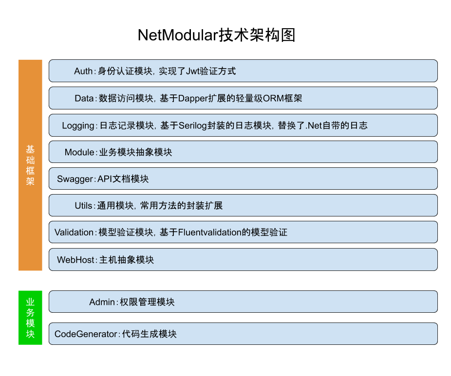

## .Net Core 模块化的前后端分离的快速开发框架

### Demo
地址：[http://118.24.75.170:6220/](http://118.24.75.170:6220/)

账户：admin  
密码：admin

### 前端框架Demo
地址：[http://progqx5cu.bkt.clouddn.com/skins/index.html#/](http://progqx5cu.bkt.clouddn.com/skins/index.html#/)  
账户：admin  
密码：admin

