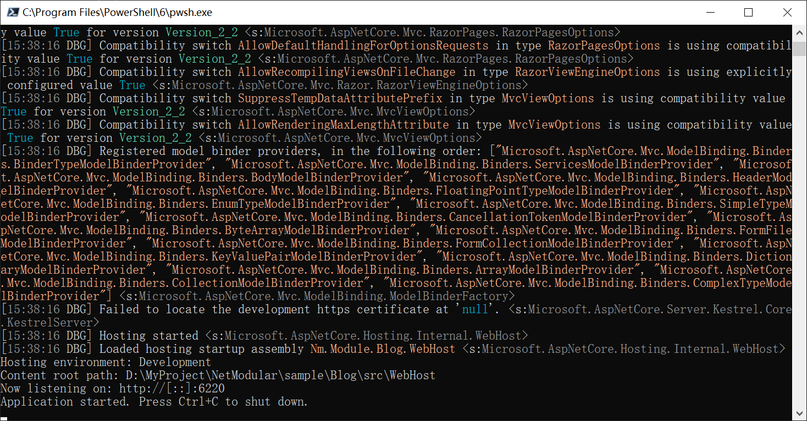
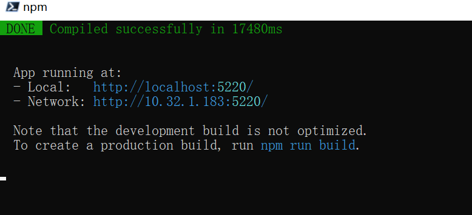

## .Net Core 模块化的前后端分离的快速开发框架

### 框架特点
1、模块化  
2、前后端分离  
3、多数据库任意切换(目前支持SqlServer、MySql、SQLite)  
4、异步到底

### Demo
地址：[http://118.24.75.170:6220/](http://118.24.75.170:6220/)

账户：admin  
密码：admin

### 前端框架Demo(临时)
地址：[http://progqx5cu.bkt.clouddn.com/skins/index.html#/](http://progqx5cu.bkt.clouddn.com/skins/index.html#/)  
账户：admin  
密码：admin

### 开发环境

#### 服务端
IDE：vs2017+  
框架：[.Net Core 2.2+](https://docs.microsoft.com/zh-cn/aspnet/core/fundamentals/?tabs=windows&view=aspnetcore-2.2#tabpanel_Rl26OFmlz8_aspnetcore2x)  
数据库：MSSQL、MySql、SQLite  
#### 前端
IDE：vscode  
框架：[Vue.js](https://cn.vuejs.org/)、[Element-UI](https://element.eleme.cn/#/zh-CN/component/layout)


### 运行方式

1、找到`sample/Blog/data`目录，按需要创建对应数据库(目前只上传了SqlServer和MySql)  
    需要注意的时，在linux的docker中mysql默认启用了区分大小写，需要关闭

2、打开`sample/Blog/src/WebHost/conifg/db.json`文件，配置数据库连接
```json
{
  //是否开启日志输出，日志中包含ORM生成的Sql语句
  "Logging": false,
  "Connections": [
    {
      //模块名称
      "Name": "Admin",
      //数据库类型：0、SqlServer 1、MySql 2、SQLite
      "Dialect": 1,
      //数据库名称
      "Database": "Nm_Admin",
      //连接字符串
      "ConnString": "Server=localhost;Database=nm_admin;Uid=root;Pwd=root;Allow User Variables=True;charset=utf8;SslMode=none;"
      //SqlServer连接字符串需要配置MultipleActiveResultSets=true
      //"ConnString": "Server=10.32.8.8;Database=Nm_Admin;Uid=sa;Pwd=sa;MultipleActiveResultSets=true;"
    },
    {
      "Name": "CodeGenerator",
      "Dialect": 1,
      "Database": "Nm_CodeGenerator",
      "ConnString": "Server=localhost;Database=nm_codegenerator;Uid=root;Pwd=root;Allow User Variables=True;charset=utf8;SslMode=none;"
    },
    {
      "Name": "Blog",
      "Dialect": 1,
      "Database": "Nm_Blog",
      "ConnString": "Server=localhost;Database=nm_blog;Uid=root;Pwd=root;Allow User Variables=True;charset=utf8;SslMode=none;"
    }
  ]
}
```

3、进入 `sample/Blog/src/WebHost/` 目录，使用控制台运行 `dotnet watch run` 命令



4、进入 `sample/Blog/src/UI/nm-module-blog` 目录，执行以下命令启动前端

```js
npm update  
npm run serve
```



5、打开浏览器，输入`http://localhost:5220/`进行浏览


